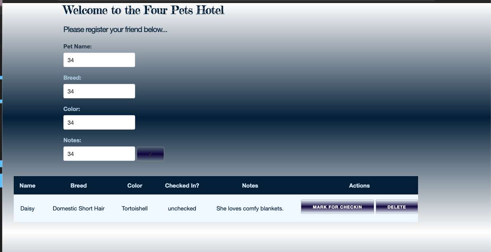

# Pet Hotel

## Description

Our client needs a full-stack application that can compete all CRUD (create, read, update, delete) requests for 
pets at their hotel. Now the Four Pets Hotels can easily track guests as they check-in and out of the hotel. 

## Screenshot
--------

##Built With

- Python 
- Flask 
- html
- css
- javascript
- jQuery
- SQL
- Postico 

## License
[MIT](https://choosealicense.com/licenses/mit/)

## Acknowledgement
Thanks to [Prime Digital Academy](www.primeacademy.io) who equipped helped me make this application a reality. Sepcial thanks to our primary instructor, [Mary Mossman](https://github.com/mbMosman)

This application was built by:
- [James Posey](https://github.com/jposeyjr)
- [Zubar Abdikadir](https://github.com/zuberabdikadir)
- [Malik Elate](https://github.com/MalikElate)
- [Jordan Newberry](https://github.com/jordanNewberry21)

## Support
If you have suggestions or issues, please contact one of the authors through github.